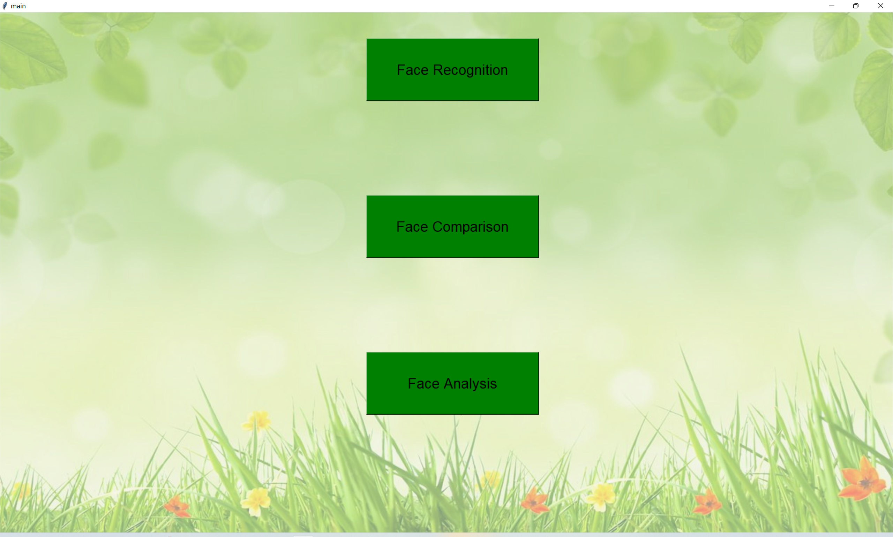

# CV-Project


### Set up

The environmental configuration requirements should be carried out according to the following code:

```shell
conda create -n cv_project python=3.8
conda activate cv_project

git clone https://github.com/cswccc/CV-Project.git
cd CV-Project

pip install -r requirements.txt
```


### Run

You can run our system through `python ui/main.py`.

#### Usage Guide

This is the main page of our system. You can click on different buttons to meet your needs



|              | Face Recognition  | Face Comparison   | Face Analysis     |
| ------------ | ----------------- | ----------------- | ----------------- |
| **Examples** |  |  |  |

